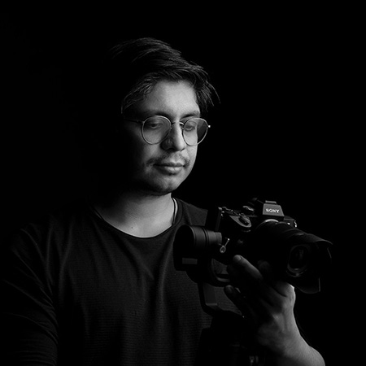
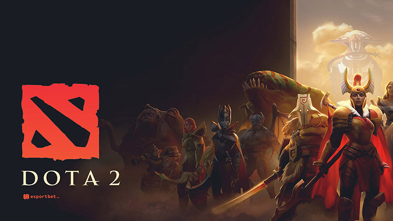
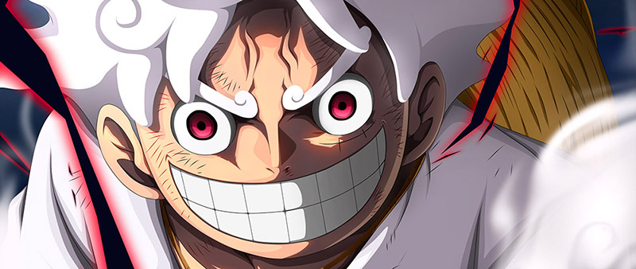
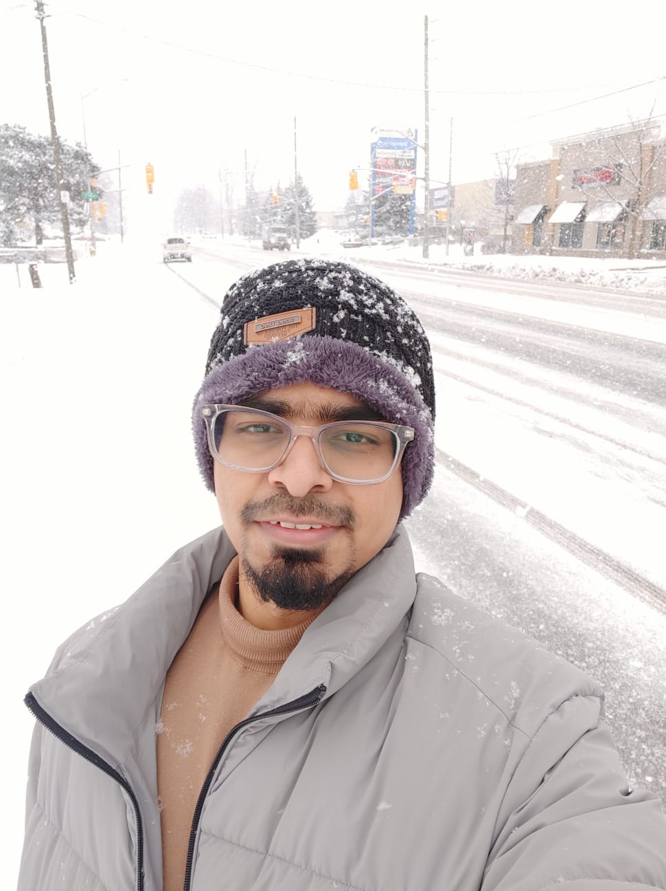
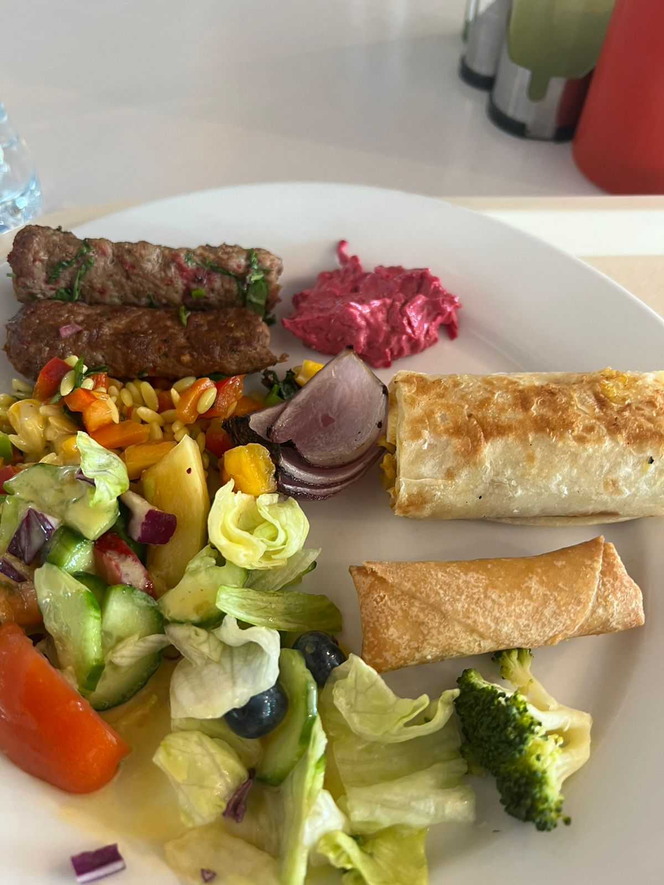
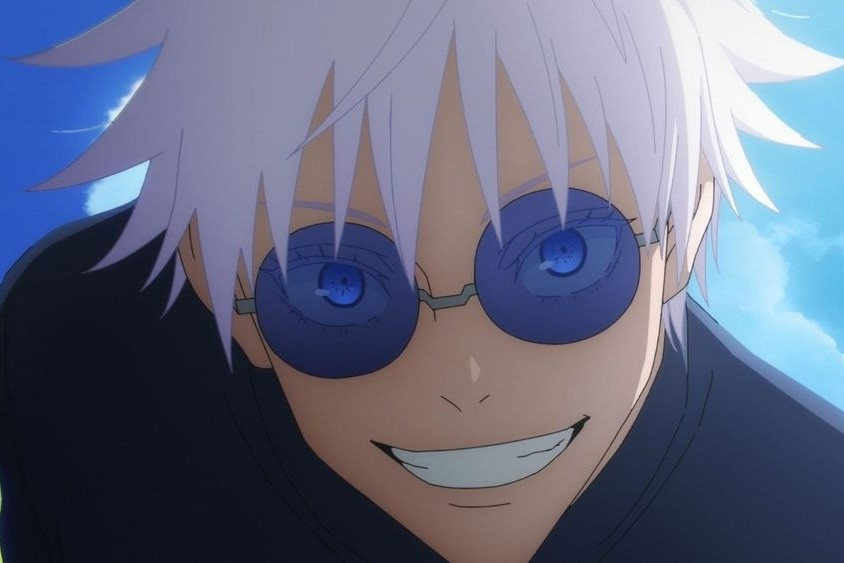

## **Cano_C_Faizan_K_HM1**
***Repo for Multimedia Authoring Homework 1***

# Hello World!

*Welcome to our page! We're **Carlos Cano** and **Faizan Khan**. We are currently studying Interactive Media Design at Fanshawe College, and we want to share just a little about us, like hobbies, likes and dislikes, unique backgrounds, and passions.
Let's dive in and let you know about us a little better.*

# I am Carlos!

In my journey spanning 14 years, I've immersed myself in the world of graphic design, weaving visual stories across billboards and packaging. My canvas extends beyond pixels to embrace branding, photography, and the art of crafting compelling narratives through videography. Beyond the technical, I thrive in the realm of remote creativity, where my commitment to excellence blends seamlessly with a passion for 

## Hoobie

***Dota 2*** is a multiplayer online battle arena (MOBA) game where two teams of five players each compete to destroy the opposing team's Ancient, a core building in their base. Players select unique heroes with distinct abilities, strategizing to outmaneuver and overpower their adversaries in intense, strategic battles across a dynamic map.

## Likes
- Eating *(just as everyone in this world)*. My favority dishes are:
  - Barbecue
  - Sushi
  - Guatita
  - Seco de pollo
- Drinks *(as the fun part of the world)*:
  - Mojito
  - Moscow Mule
  - Gin
  - Beer
- [Amazon Website](http://www.amazon.ca)
- Watch anime

## Dislikes

~~Mondays and wash the dishes~~

<!-- Start here with your info -->

# I am Faizan!

I've been working as a UX/ UI Designer for approx 2 years, In my carrer I have worked with various startups and sometimes as a solo designer. It has been a fruitful journey so far and I'm proud of the things I've achieved. My curiosity about the design brought me here to Fanshawe College where I'm studying Interactive Media Design Program

## Hoobie

I love Cooking so much so if I wasn't passionate about the design, I would have become a chef. Cooking feels like a therapy and it's wonderful just by mixing some ingredients you can create a complete different dish.

## Likes
- Excercise
- Swimming
- Travelling
- Video games
- Snooker
- Watch anime

## Dislikes

~~Working out~~

___
## Installation
No installation required
## Usage
Use as you wish
## Contributing
1. Fork it!
2. Create your feature branch: `git checkout -b my-new-feature`
3. Commit your changes: `git commit -am 'Add some feature'`
4. Push to the branch: `git push origin my-new-feature`
5. Submit a pull request :D
## History
January, 2024
## Credits
Carlos Cano

Faizan Khan
## License
MIT Licence
